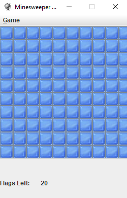

# Project Name
> Mines is a puzzle game built in Java7 using the JavaFX library

* Fully functional minesweeper clone
* An option to increase or decrese the difficulty of the game after beating it once

To-do list:
* UI imporvements
* More options

## Table of contents
* [Screenshots](#screenshots)
* [Setup](#setup)
* [Features](#features)
* [Status](#status)
* [Inspiration](#inspiration)
* [Contact](#contact)

## Screenshots

## Setup
To run open the Mines.jar file

## Status
Project is in progress.

## Inspiration
Based on Minesweeper by Microsoft

## Contact
Created by Miroslav Tetevenski. Feel free to contact me at miroslav.tetevenski@gmail.com